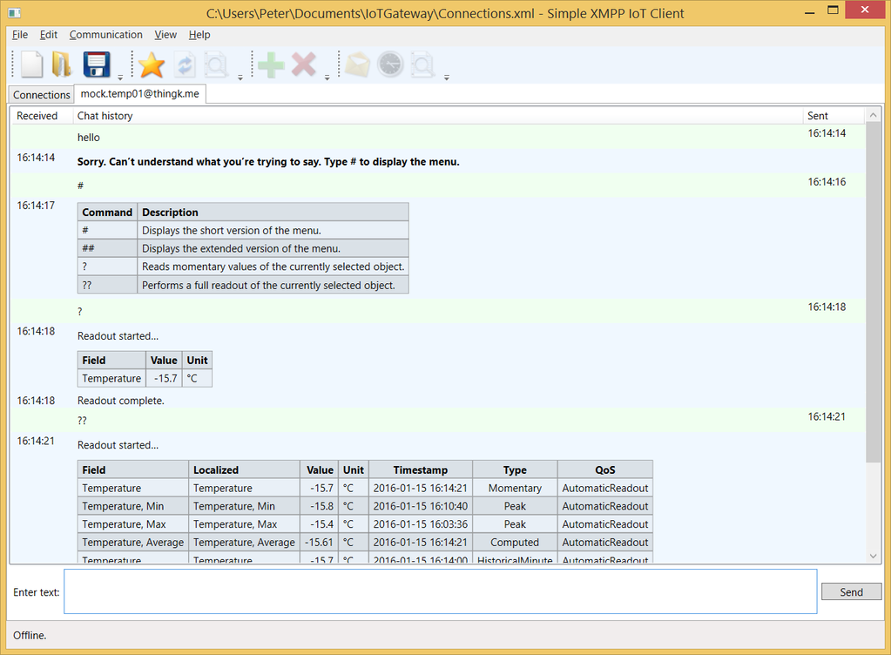
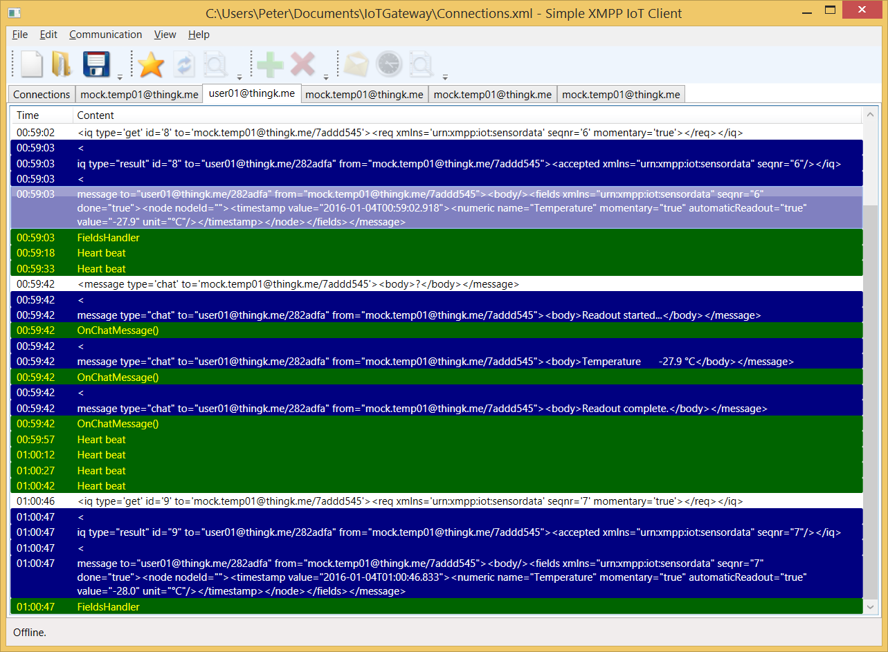
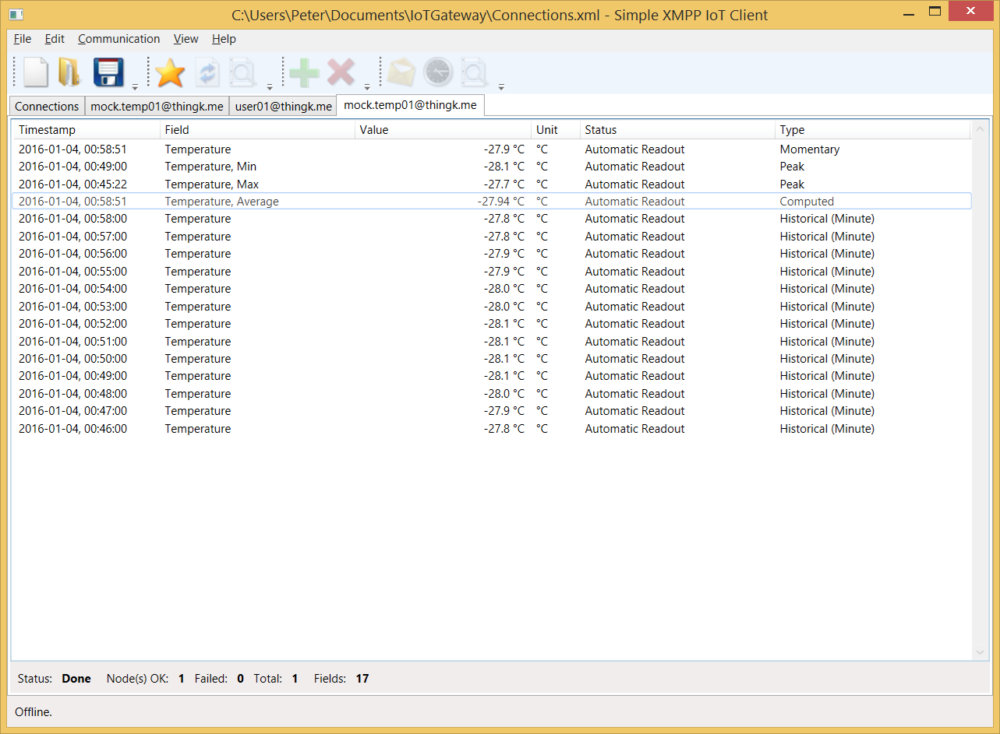

# Waher.Client.WPF

The **Waher.Client.WPF** project implements a simple IoT client that allows you to interact with things and users. If you connect to the network, you can 
chat with both users and things. The client GUI is built using Windows Presentation Foundation (WPF). Chat sessions support normal plain text content, and 
rich content based on markdown. The client also supports multiple connections to different servers.

To allow developers to understand underlying network protocols, the IoT client provides sniffers that display detailed information about the underlying 
protocol.

Apart from normal Instant Messaging features, the IoT client also includes integrated support for M2M and IoT protocols. 

## Binary executable

You can test the application by downloading a [binary executable](../../Executables/Waher.Client.WPF.zip).

## License

You should carefully read the following terms and conditions before using this software. Your use of this software indicates
your acceptance of this license agreement and warranty. If you do not agree with the terms of this license, or if the terms of this
license contradict with your local laws, you must remove any files from the **IoT Gateway** from your storage devices and cease to use it. 
The terms of this license are subjects of changes in future versions of the **IoT Gateway**.

You may not use, copy, emulate, clone, rent, lease, sell, modify, decompile, disassemble, otherwise reverse engineer, or transfer the
licensed program, or any subset of the licensed program, except as provided for in this agreement.  Any such unauthorised use shall
result in immediate and automatic termination of this license and may result in criminal and/or civil prosecution.

The [source code](https://github.com/PeterWaher/IoTGateway) provided in this project is provided open for the following uses:

* For **Personal evaluation**. Personal evaluation means evaluating the code, its libraries and underlying technologies, including learning 
	about underlying technologies.

* For **Academic use**. If you want to use the following code for academic use, all you need to do is to inform the author of who you are, what 
	academic institution you work for (or study for), and in what projects you intend to use the code. All I ask in return is for an 
	acknowledgement and visible attribution to this project, inluding a link, and that you do not redistribute the source code, or parts thereof 
	in the solutions you develop. If any solutions developed in an academic setting, become commercial, it will need a commercial license.

* For **Security analysis**. If you perform any security analysis on the code, to see what security aspects the code might have,
	all I ask is that you inform me of any findings so that any vulnerabilities might be addressed. I am thankful for any such contributions,
	and will acknowledge them.

All rights to the source code are reserved and exclusively owned by [Waher Data AB](http://waher.se/). If you're interested in using the 
source code, as a whole, or partially, you need a license agreement with the author. You can contact him through [LinkedIn](http://waher.se/).

This software is provided by the copyright holder and contributors "as is" and any express or implied warranties, including, but not limited to, 
the implied warranties of merchantability and fitness for a particular purpose are disclaimed. In no event shall the copyright owner or contributors 
be liable for any direct, indirect, incidental, special, exemplary, or consequential damages (including, but not limited to, procurement of substitute 
goods or services; loss of use, data, or profits; or business interruption) however caused and on any theory of liability, whether in contract, strict 
liability, or tort (including negligence or otherwise) arising in any way out of the use of this software, even if advised of the possibility of such 
damage.

The **IoT Gateway** is &copy; [Waher Data AB](http://waher.se/) 2016.
 

