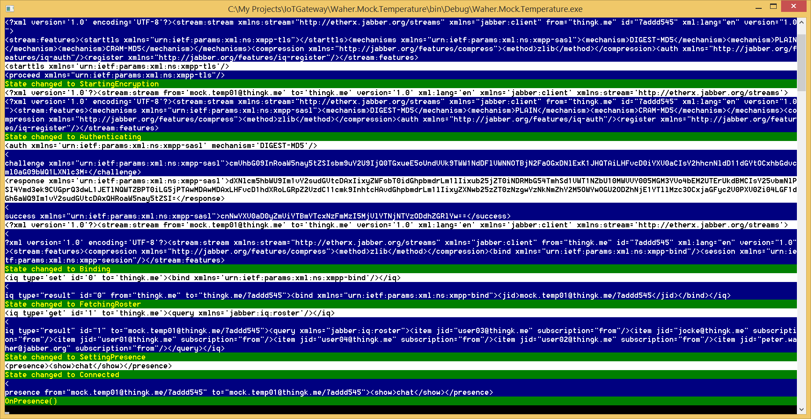

# Waher.Mock.Temperature

The **Waher.Mock.Temperature** project simulates a simple temperature sensor with an XMPP interface. It publishes sensor data, 
corresponding interoperability interfaces and a chat interface.

The first time the application is run, it provides a simple console interface for the user to provide network credentials. 
These credentials are then stored in the **xmpp.config** file. Passwords are hashed. 

## Console interface

It also outputs any events and network communication to the console, to facilitate implementation of IoT interfaces. 

## Interaction with a Thing Registry

If the application is interacting with a Thing Registry, it will display a QR Code on the console screen during startup. This QR Code
encodes an URI containing the meta-data necessary to claim the device.

## Binary executable

You can test the application by downloading a [binary executable](../../Executables/Waher.Mock.Temperature.zip). If you don't have an XMPP client
you can use to chat with the sensor, or if the one you use does not support the XMPP IoT XEPs, you can also download the
[WPF client](../../Executables/Waher.Client.WPF.zip) available in the solution.

## License

You should carefully read the following terms and conditions before using this software. Your use of this software indicates
your acceptance of this license agreement and warranty. If you do not agree with the terms of this license, or if the terms of this
license contradict with your local laws, you must remove any files from the **IoT Gateway** from your storage devices and cease to use it. 
The terms of this license are subjects of changes in future versions of the **IoT Gateway**.

You may not use, copy, emulate, clone, rent, lease, sell, modify, decompile, disassemble, otherwise reverse engineer, or transfer the
licensed program, or any subset of the licensed program, except as provided for in this agreement.  Any such unauthorised use shall
result in immediate and automatic termination of this license and may result in criminal and/or civil prosecution.

The [source code](https://github.com/PeterWaher/IoTGateway) provided in this project is provided open for the following uses:

* For **Personal evaluation**. Personal evaluation means evaluating the code, its libraries and underlying technologies, including learning 
	about underlying technologies.

* For **Academic use**. If you want to use the following code for academic use, all you need to do is to inform the author of who you are, what 
	academic institution you work for (or study for), and in what projects you intend to use the code. All I ask in return is for an 
	acknowledgement and visible attribution to this project, inluding a link, and that you do not redistribute the source code, or parts thereof 
	in the solutions you develop. If any solutions developed in an academic setting, become commercial, it will need a commercial license.

* For **Security analysis**. If you perform any security analysis on the code, to see what security aspects the code might have,
	all I ask is that you inform me of any findings so that any vulnerabilities might be addressed. I am thankful for any such contributions,
	and will acknowledge them.

All rights to the source code are reserved and exclusively owned by [Waher Data AB](http://waher.se/). If you're interested in using the 
source code, as a whole, or partially, you need a license agreement with the author. You can contact him through [LinkedIn](http://waher.se/).

This software is provided by the copyright holder and contributors "as is" and any express or implied warranties, including, but not limited to, 
the implied warranties of merchantability and fitness for a particular purpose are disclaimed. In no event shall the copyright owner or contributors 
be liable for any direct, indirect, incidental, special, exemplary, or consequential damages (including, but not limited to, procurement of substitute 
goods or services; loss of use, data, or profits; or business interruption) however caused and on any theory of liability, whether in contract, strict 
liability, or tort (including negligence or otherwise) arising in any way out of the use of this software, even if advised of the possibility of such 
damage.

The **IoT Gateway** is &copy; [Waher Data AB](http://waher.se/) 2016.
 

