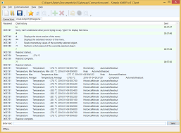
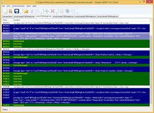
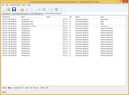
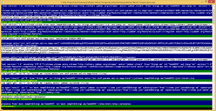

# IoTGateway

**IoTGateway** is a C# implementation of an IoT gateway. It is self contained, and includes all libraries and frameworks 
it needs to operate. Example applications also include binary downloads.

The solution is divided into different groups of projects:

* [Clients](#clients)
* [Content](#content)
* [Events](#events)
* [Mocks](#mocks)
* [Networking](#networking)
* [Script](#script)
* [Things](#things)
* [Utilities](#utilities)

## License

The source code provided in this project is provided open for the following uses:

* For **Personal evaluation**. Personal evaluation means evaluating the code, its libraries and underlying technologies, including learning 
	about underlying technologies.

* For **Academic use**. If you want to use the following code for academic use, all you need to do is to inform the author of who you are, what academic
	institution you work for (or study for), and in what projects you intend to use the code.

* For **Security analysis**. If you perform any security analysis on the code, to see what security aspects the code might have,
	all I ask is that you inform me of any findings so that any vulnerabilities might be addressed. I am thankful for any such contributions,
	and will acknowledge them.

All rights to the source code are reserved. If you're interested in using the source code, as a whole, or partially, you need a license agreement
with the author. You can contact him through [LinkedIn](http://waher.se/).

This software is provided by the copyright holders and contributors "as is" and any express or implied warranties, including, but not limited to, 
the implied warranties of merchantability and fitness for a particular purpose are disclaimed. In no event shall the copyright owner or contributors 
be liable for any direct, indirect, incidental, special, exemplary, or consequential damages (including, but not limited to, procurement of substitute 
goods or services; loss of use, data, or profits; or business interruption) however caused and on any theory of liability, whether in contract, strict 
liability, or tort (including negligence or otherwise) arising in any way out of the use of this software, even if advised of the possibility of such 
damage.

## Clients

The [Clients](Clients) folder contains projects starting with **Waher.Client.** and denote client projects. Clients are front-end applications that 
can be run by users to perform different types of interaction with things or the network.

### Waher.Client.WPF

| Screen Shot | Project description |
|-------------|---------------------|
|| The [Waher.Client.WPF](Clients/Waher.Client.WPF) project is a simple IoT client that allows you to interact with things and users. If you connect to the network, you can chat with users and things. The client GUI is built using Windows Presentation Foundation (WPF). [Full Screen Shot.](Images/Waher.Client.WPF.1.png) [Executable.](Executables/Waher.Client.WPF.zip) |
|| To allow developers to understand underlying network protocols, the IoT client provides sniffers that display detailed information about the underlying protocol. [Full Screen Shot.](Images/Waher.Client.WPF.2.png) |
|| Apart from normal Instant Messaging features, the IoT client also includes integrated support for M2M and IoT protocols. [Full Screen Shot.](Images/Waher.Client.WPF.3.png) |

## Content

The [Content](Content) folder contains libraries that manage Internet Content, and Internet Content Type encodings and decodings.

| Project | Project description |
|-------------|---------------------|
| **Waher.Content** | The [Waher.Content](Content/Waher.Content) project is a class library that provides basic abstraction for Internet Content Type, and basic encodings and decodings, including common data types and parsing, etc. |
| **Waher.Content.Drawing** | The [Waher.Content.Drawing](Content/Waher.Content.Drawing) project contains encoders and decoders for images, as defined in the **System.Drawing** library. |
| **Waher.Content.Emoji** | The [Waher.Content.Emoji](Content/Waher.Content.Emoji) project contains utilities for working with emojis. |
| **Waher.Content.Emoji.Emoji1** | The [Waher.Content.Emoji.Emoji1](Content/Waher.Content.Emoji.Emoji1) project provide free emojis from [Emoji One](http://emojione.com/) to content applications. |
| **Waher.Content.Markdown** | The [Waher.Content.Markdown](Content/Waher.Content.Markdown) project parses markdown documents and transforms them to other formats, such as HTML, Plain text and XAML. For a description of the markdown flavour supported by the parser, see [Markdown documentation](Markdown.md). |
| **Waher.Content.Markdown.Test** | The [Waher.Content.Markdown.Test](Content/Waher.Content.Markdown.Test) project contains unit tests for the **Waher.Content.Markdown** project. |

## Events

The [Events](Events) folder contains libraries that manage different aspects of event logging in networks.

| Project | Project description |
|-------------|---------------------|
| **Waher.Events** | The [Waher.Events](Events/Waher.Events) project provides the basic architecture and framework for event logging in applications. It uses the static class **Log** as a hub for all type of event logging in applications. To this hub you can register any number of **Event Sinks** that receive events and distribute them according to implementation details in each one. By logging all events to **Log** you have a configurable environment where you can change logging according to specific needs of the project. |
| **Waher.Events.Console** | The [Waher.Events.Console](Events/Waher.Events.Console) project provides a simple event sink, that outputs events to the console standard output. Useful, if creating simple console applications. |
| **Waher.Events.Documentation** | The [Waher.Events.Documentation](Events/Waher.Events.Documentation) project contains documentation of specific important events. This documentation includes Event IDs and any parameters they are supposed to include. |
| **Waher.Events.XMPP** | The [Waher.Events.XMPP](Events/Waher.Events.XMPP) project defines an event sink that distributes events over XMPP, according to [XEP-0337](http://xmpp.org/extensions/xep-0337.html). |

## Mocks

The [Mocks](Mocks) folder contains projects that implement different mock devices. These can be used as development tools to test technologies, 
implementation, networks and tools.

| Project | Project description |
|-------------|---------------------|
| **Waher.Mock** | The [Waher.Mock](Mocks/Waher.Mock) project is a class library that provides support for simple mock applications. This includes simple network configuration. |
| | The [Waher.Mock.Temperature](Mocks/Waher.Mock.Temperature) project simulates a simple temperature sensor with an XMPP interface. The first time the application is run, it provides a simple console interface for the user to provide network credentials. It also outputs any events and network communication to the console, to facilitate implementation of IoT interfaces. [Full Screen Shot.](Images/Waher.Mock.Temperature.png) [Executable.](Executables/Waher.Mock.Temperature.zip) |

## Networking

The [Networking](Networking) folder contains libraries that manage different aspects of network communication.

| Project | Project description |
|-------------|---------------------|
| **Waher.Networking** | The [Waher.Networking](Networking/Waher.Networking) project provides the basic architecture and tools for all networking libraries.  This includes sniffers, timing, etc. |
| **Waher.Networking.MQTT** | The [Waher.Networking.MQTT](Networking/Waher.Networking.MQTT) project provides a simple MQTT client. |
| **Waher.Networking.PeerToPeer** | The [Waher.Networking.PeerToPeer](Networking/Waher.Networking.PeerToPeer) project provides tools for peer-to-peer communication. |
| **Waher.Networking.UPnP** | The [Waher.Networking.UPnP](Networking/Waher.Networking.UPnP) project provides a library for interacting with UPnP-enabled devices in the network. |
| **Waher.Networking.XMPP** | The [Waher.Networking.XMPP](Networking/Waher.Networking.XMPP) project provides a simple XMPP client. |
| **Waher.Networking.XMPP.Chat** | The [Waher.Networking.XMPP.Chat](Networking/Waher.Networking.XMPP.Chat) project provides a simple XMPP chat server bot for things, that is added to the XMPP client defined in [Waher.Networking.XMPP](Networking/Waher.Networking.XMPP). It follows the chat semantics outlined in this proto-XEP: [Chat Interface for Internet of Things Devices](http://htmlpreview.github.io/?https://github.com/joachimlindborg/XMPP-IoT/blob/master/xep-0000-IoT-Chat.html) |
| **Waher.Networking.XMPP.Interoperability** | The [Waher.Networking.XMPP.Interoperability](Networking/Waher.Networking.XMPP.Interoperability) project provides an add-on to the XMPP client defined in [Waher.Networking.XMPP](Networking/Waher.Networking.XMPP). This add-on provides client and server interoperability capabilities, as defined in this proto-XEP: [Internet of Things - Interoperability](http://htmlpreview.github.io/?https://github.com/joachimlindborg/XMPP-IoT/blob/master/xep-0000-IoT-Interoperability.html) |
| **Waher.Networking.XMPP.Sensor** | The [Waher.Networking.XMPP.Sensor](Networking/Waher.Networking.XMPP.Sensor) project provides an add-on to the XMPP client defined in [Waher.Networking.XMPP](Networking/Waher.Networking.XMPP). This add-on provides client and server sensor capabilities, as defined in [XEP-0323](http://xmpp.org/extensions/xep-0323.html). |
| **Waher.Networking.XMPP.Test** | The [Waher.Networking.XMPP.Test](Networking/Waher.Networking.XMPP.Test) project contains unit-tests for the [Waher.Networking.XMPP](Networking/Waher.Networking.XMPP) library and add-ons. |

## Script

The [Script](Script) folder contains libraries that manage scripting.

| Project | Project description |
|-------------|---------------------|
| **Waher.Script** | The [Waher.Script](Script/Waher.Script) project is a class library that provides basic execution model for scripting. |

## Things

The [Things](Things) folder contains libraries that manage data abstraction for things.

| Project | Project description |
|-------------|---------------------|
| **Waher.Things** | The [Waher.Things](Things/Waher.Things) project is a class library that provides basic abstraction of things, errors, sensor data and control operations. |

## Utilities

The [Utilities](Utilities) folder contains applications that help the developer or administrator with different tasks.

| Project | Project description |
|-------------|---------------------|
| **Waher.Utility.GetEmojiCatalog** | The [Waher.Utility.GetEmojiCatalog](Utilities/Waher.Utility.GetEmojiCatalog) project downloads an [emoji catalog](http://unicodey.com/emoji-data/table.htm) and extracts the information and generates code for handling emojis. |

## Unit Tests

All unit tests are run using [NUnit v2.6.4](http://nunit.org/?p=download).