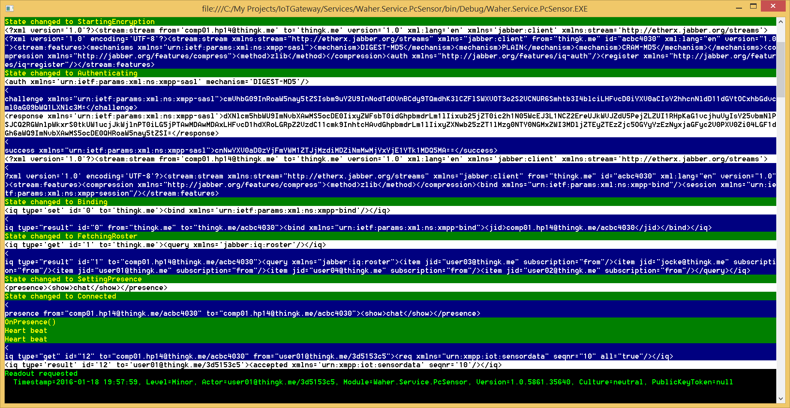
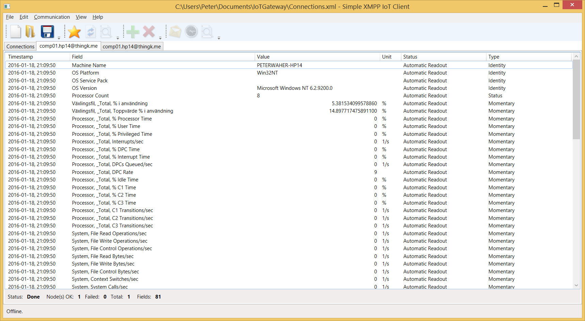
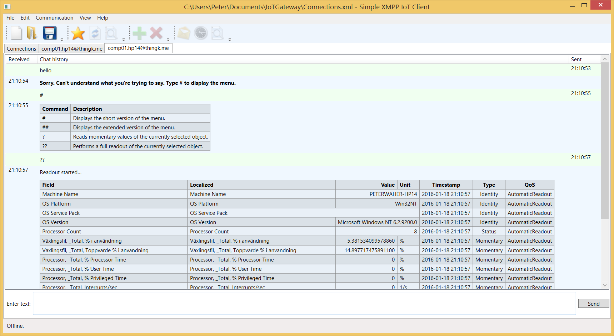

# Waher.Service.PcSensor

The **Waher.Service.PcSensor** project defines an application that converts your PC into an IoT sensor, by publishing performace counters as 
sensor values.

The first time the application is run, it provides a simple console interface for the user to provide network credentials. 
These credentials are then stored in the **xmpp.config** file. Passwords are hashed.

When it is read for the first time, it also creates a file called [categories.xml](#categories_xml) which lists all performance counter categories found, and 
if they should be included in the data readout or not. If new categories are found during the runtime of the application, the file is updated. 
By default, new categories are not included. 

## Console interface

The console interface can be used for two purposes:

1. To enter credentials for the XMPP connection. This is done the first time the application is run.
2. To view XMPP communication. This is done if a sniffer is enabled in the first step.



## Sensor data

The application publishes performance counter values as sensordata using XMPP, and [XEP-0323](http://xmpp.org/extensions/xep-0323.html). 
Which performance counters to publish is defined in the [categories.xml](#categories_xml) file.



## Chat interface

As the application is available through XMPP, it also publishes a chat interface:



## Binary

You can test the application by downloading a [binary executable](../../Executables/Waher.Service.PcSensor.zip)

## Categories XML

After the first readout, a file called **categories.xml** is created. It includes all performance counter categories found. By default, no categories
are included in the readout. The file is updated if new categories are installed. To publish a category, set the **include** attribute to **true**.

In multi-instance categories, all instances are included by default, if not specified otherwise. To limit the category to certain instance names,
specify which ones using **Instance** elements.

### Example

Following is an example of a **categories.xml** file:

```XML
<?xml version="1.0" encoding="utf-8"?>
<Categories xmlns="http://waher.se/PerformanceCounterCategories.xsd">
	<Category name=".NET CLR-data" include="true" />
	<Category name=".NET CLR-nätverk" include="true" />
	<Category name=".NET CLR-nätverk 4.0.0.0" include="true" />
	<Category name=".NET-dataprovider för Oracle" include="false" />
	<Category name=".NET-dataprovider för SqlServer" include="false" />
	<Category name="Aktivitet för gränssnittskort i fysiskt nätverk" include="false" />
	<Category name="Aktivitet på nätverkskort per processor" include="false" />
	<Category name="ASP.NET" include="false" />
	<Category name="ASP.NET v4.0.30319" include="false" />
	<Category name="ASP.NET-tillståndstjänst" include="false" />
	<Category name="ASP.NET-tillämpningar" include="false" />
	<Category name="ASP.NET-tillämpningar v4.0.30319" include="false" />
	<Category name="Bakåtkompatibelt nätverkskort för Hyper-V" include="false" />
	<Category name="BitLocker" include="false" />
	<Category name="Bläddraren" include="false" />
	<Category name="BranchCache" include="false" />
	<Category name="Cache" include="false" />
	<Category name="Cachelagring på klientsidan" include="false" />
	<Category name="Diskaktivitet från filsystemet" include="false" />
	<Category name="Distribuerad routningstabell" include="false" />
	<Category name="Distributed Transaction Coordinator" include="false" />
	<Category name="Dynamiskt minne för virtuell dator för Hyper-V" include="false" />
	<Category name="Energimätare" include="false" />
	<Category name="Faxtjänst" include="false" />
	<Category name="Fjärrkommunikation för Hyper-V VM" include="false" />
	<Category name="Fysisk disk" include="false" />
	<Category name="Generisk IKEv1, IKEv2 och AuthIP" include="false" />
	<Category name="Global DNS64" include="false" />
	<Category name="GPU-hantering för RemoteFX-rot" include="false" />
	<Category name="Hyper-V Hypervisor" include="false" />
	<Category name="Hyper-V hypervisor - virtuella processorer" include="false" />
	<Category name="Hyper-V hypervisor - virtuella processorer (rot)" include="false" />
	<Category name="Hyper-V hypervisor-rotpartition" include="false" />
	<Category name="Hyper-V Replica VM" include="false" />
	<Category name="Hyper-V Virtual Storage Device" include="false" />
	<Category name="Hyper-V virtuell växel" include="false" />
	<Category name="Hyper-V virtuell växelport" include="false" />
	<Category name="Hyper-V virtuellt nätverkskort" include="false" />
	<Category name="Hyper-V VM IO APIC" include="false" />
	<Category name="Hyper-V VM Vid Partition" include="false" />
	<Category name="Hyper-V VM VID-drivrutin" include="false" />
	<Category name="Hyper-V-direktmigrering av virtuell dator" include="false" />
	<Category name="Händelsespårning för Windows" include="false" />
	<Category name="Händelsespårning för Windows-session" include="false" />
	<Category name="ICMP" include="false" />
	<Category name="ICMPv6" include="false" />
	<Category name="Information om jobbobjekt" include="false" />
	<Category name="IPHTTPS Global" include="false" />
	<Category name="IPHTTPS-session" include="false" />
	<Category name="IPsec AuthIP IPv4" include="false" />
	<Category name="IPsec AuthIP IPv6" include="false" />
	<Category name="IPsec IKEv1 IPv4" include="false" />
	<Category name="IPsec IKEv1 IPv6" include="false" />
	<Category name="IPsec IKEv2 IPv4" include="false" />
	<Category name="IPsec IKEv2 IPv6" include="false" />
	<Category name="IPsec-anslutningar" include="false" />
	<Category name="IPsec-drivrutin" include="false" />
	<Category name="IPv4" include="false" />
	<Category name="IPv6" include="false" />
	<Category name="Jobbobjekt" include="true" />
	<Category name="Kvotstatistik för WSMan" include="false" />
	<Category name="Logisk disk" include="false" />
	<Category name="Logisk processor för Hyper-V Hypervisor" include="false" />
	<Category name="Microsoft Winsock BSP" include="false" />
	<Category name="Minne" include="true" />
	<Category name="Minneshanteraren för arbetsprocessen för Hyper-V-baserade virtuella datorer" include="false" />
	<Category name="MSDTC Bridge 3.0.0.0" include="false" />
	<Category name="MSDTC Bridge 4.0.0.0" include="false" />
	<Category name="MSRS 2014 Web Service" include="false" />
	<Category name="MSRS 2014 Web Service SharePoint Mode" include="false" />
	<Category name="MSRS 2014 Windows Service" include="false" />
	<Category name="MSRS 2014 Windows Service SharePoint Mode" include="false" />
	<Category name="NBT-anslutningar" include="false" />
	<Category name="Netlogon" include="false" />
	<Category name="Nivån Lagringsutrymmen" include="false" />
	<Category name="NUMA-nodminne" include="false" />
	<Category name="Nätverksaktivitetscykler per processor" include="false" />
	<Category name="Nätverksgränssnitt" include="false" />
	<Category name="Nätverkskort" include="false" />
	<Category name="Nätverksprincip för QoS" include="false" />
	<Category name="Nätverksvirtualisering" include="false" />
	<Category name="Objekt" include="true" />
	<Category name="Offline Files" include="false" />
	<Category name="Omdirigeraren" include="false" />
	<Category name="Pacer-flöde" include="false" />
	<Category name="Pacer-rör" include="false" />
	<Category name="Partition för Hyper-V Hypervisor" include="false" />
	<Category name="Peer Name Resolution Protocol" include="false" />
	<Category name="Process" include="false" />
	<Category name="Processor" include="true">
		<Instance name="_Total"/>
	</Category>
	<Category name="Processor för virtuell Hyper-V-växel" include="false" />
	<Category name="Processorinformation" include="false" />
	<Category name="RAS" include="false" />
	<Category name="RAS-port" include="false" />
	<Category name="RemoteFX-grafik" include="false" />
	<Category name="RemoteFX-nätverk" include="false" />
	<Category name="ReportServer:Service" include="false" />
	<Category name="ReportServerSharePoint:Service" include="false" />
	<Category name="Sammanfattning av hälsa hos virtuell dator för Hyper-V" include="false" />
	<Category name="Sammanlagd RAS" include="false" />
	<Category name="ServiceModelEndpoint 3.0.0.0" include="false" />
	<Category name="ServiceModelEndpoint 4.0.0.0" include="false" />
	<Category name="ServiceModelOperation 3.0.0.0" include="false" />
	<Category name="ServiceModelOperation 4.0.0.0" include="false" />
	<Category name="ServiceModelService 3.0.0.0" include="false" />
	<Category name="ServiceModelService 4.0.0.0" include="false" />
	<Category name="Skrivcache för Lagringsutrymmen" include="false" />
	<Category name="SMB-serverresurser" include="false" />
	<Category name="SMB-serversessioner" include="false" />
	<Category name="SMSvcHost 3.0.0.0" include="false" />
	<Category name="SMSvcHost 4.0.0.0" include="false" />
	<Category name="Spara, ta ögonblicksbild och återställ för Hyper-V VM" include="false" />
	<Category name="SQLServer:Workload Group Stats" include="false" />
	<Category name="SynchronizationNuma" include="false" />
	<Category name="Synkronisering" include="false" />
	<Category name="System" include="true" />
	<Category name="Sökindexerare" include="false" />
	<Category name="TCPIP-prestandadiagnostik" include="false" />
	<Category name="TCPv4" include="false" />
	<Category name="TCPv6" include="false" />
	<Category name="Telefoni" include="false" />
	<Category name="Teredo-klient" include="false" />
	<Category name="Teredo-relä" include="false" />
	<Category name="Teredo-server" include="false" />
	<Category name="Terminal Services" include="false" />
	<Category name="Thermal Zone-information" include="false" />
	<Category name="Tråd" include="false" />
	<Category name="UDPv4" include="false" />
	<Category name="UDPv6" include="false" />
	<Category name="USB" include="false" />
	<Category name="Utjämnare för dynamiskt minne för Hyper-V" include="false" />
	<Category name="Utskriftskö" include="false" />
	<Category name="WF (System.Workflow) 4.0.0.0" include="false" />
	<Category name="WFP" include="false" />
	<Category name="WFPv4" include="false" />
	<Category name="WFPv6" include="false" />
	<Category name="VGPU-hantering för virtuell dator med RemoteFX" include="false" />
	<Category name="Windows Workflow Foundation" include="false" />
	<Category name="Virtuell IDE-styrenhet för Hyper-V (emulerad)" include="false" />
	<Category name="VM VID NUMA-nod för Hyper-V" include="false" />
	<Category name="WorkflowServiceHost 4.0.0.0" include="false" />
	<Category name="Växlingsfil" include="true">
		<Instance name="_Total"/>
	</Category>
	<Category name="XHCI CommonBuffer" include="false" />
	<Category name="XHCI Interrupter" include="false" />
	<Category name="XHCI TransferRing" include="false" />
</Categories>
```

## License

The source code provided in this project is provided open for the following uses:

* For **Personal evaluation**. Personal evaluation means evaluating the code, its libraries and underlying technologies, including learning 
	about underlying technologies.

* For **Academic use**. If you want to use the following code for academic use, all you need to do is to inform the author of who you are, what academic
	institution you work for (or study for), and in what projects you intend to use the code.

* For **Security analysis**. If you perform any security analysis on the code, to see what security aspects the code might have,
	all I ask is that you inform me of any findings so that any vulnerabilities might be addressed. I am thankful for any such contributions,
	and will acknowledge them.

All rights to the source code are reserved. If you're interested in using the source code, as a whole, or partially, you need a license agreement
with the author. You can contact him through [LinkedIn](http://waher.se/).

This software is provided by the copyright holders and contributors "as is" and any express or implied warranties, including, but not limited to, 
the implied warranties of merchantability and fitness for a particular purpose are disclaimed. In no event shall the copyright owner or contributors 
be liable for any direct, indirect, incidental, special, exemplary, or consequential damages (including, but not limited to, procurement of substitute 
goods or services; loss of use, data, or profits; or business interruption) however caused and on any theory of liability, whether in contract, strict 
liability, or tort (including negligence or otherwise) arising in any way out of the use of this software, even if advised of the possibility of such 
damage.
