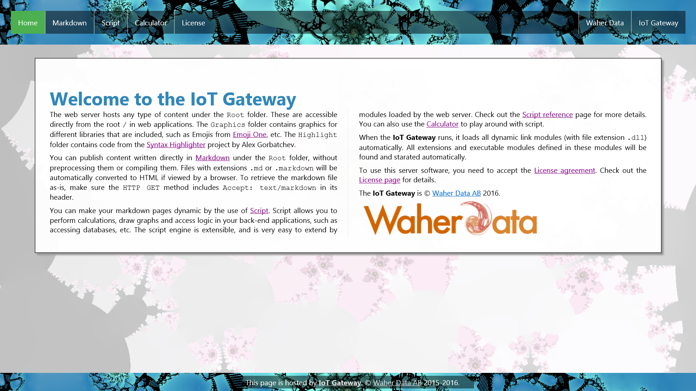
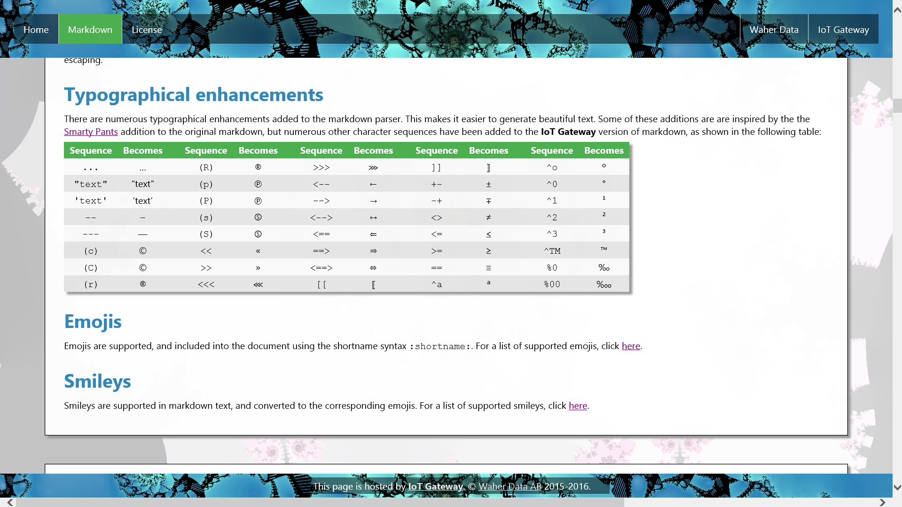
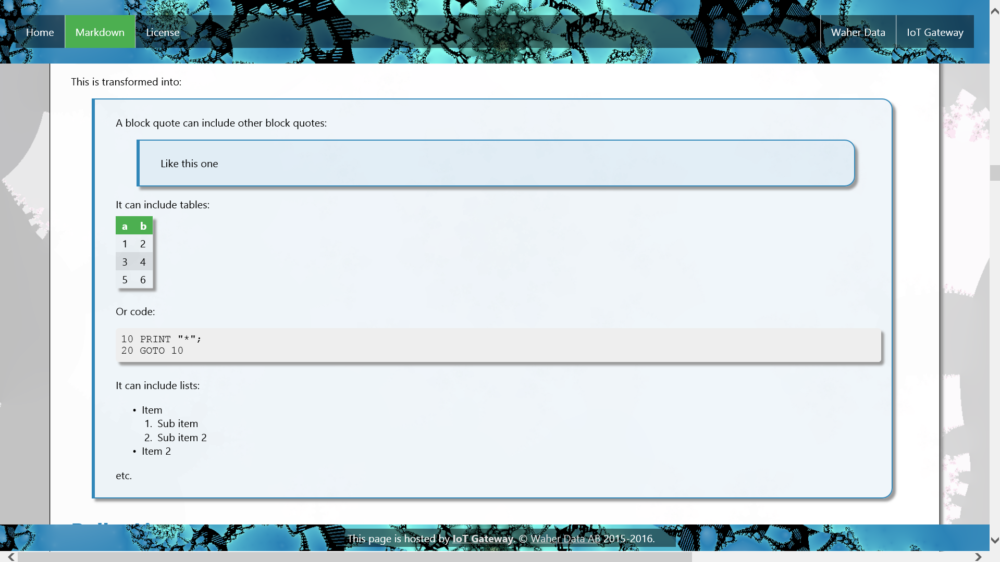
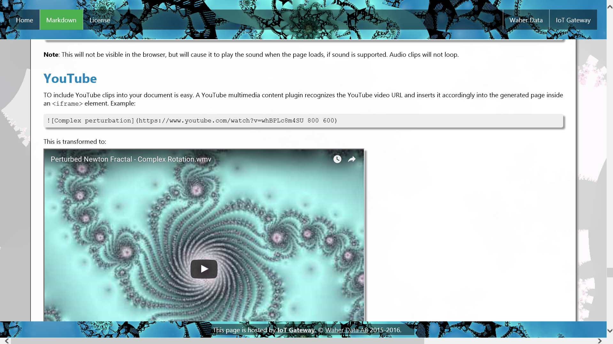
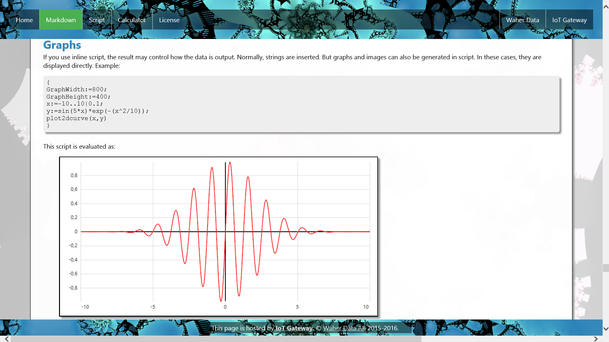
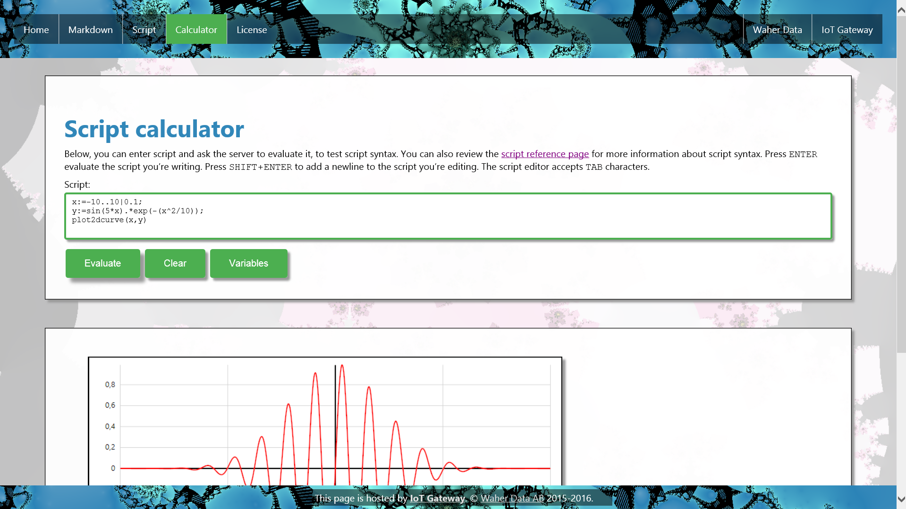
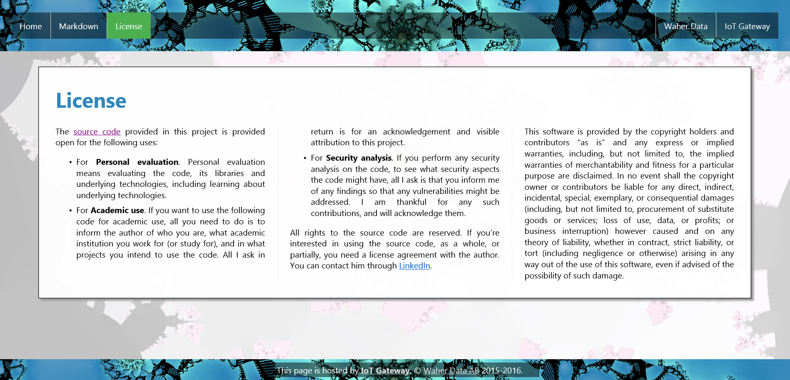
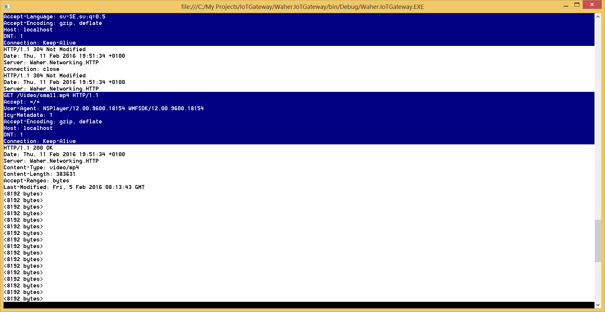

# Waher.IoTGateway.Console

The **Waher.IoTGateway.Console** is a console application version of the [IoT Gateway](../Waher.IoTGateway). 
It's easy to use and experiment with. It uses XMPP and can be administered using the 
[Waher.Client.WPF](../Clients/Waher.Client.WPF) application.

When running the application for the first time, you need to configure it. You do this by navigating to it using
a browse. You will be displayed a sequence of dialogs that you need to fill in, to configure different aspects
of the system. This includes setting up the connection to the XMPP network.

The [Waher.IoTGateway.Svc](../Waher.IoTGateway.Svc) project provides a Windows Service for the **IoT Gateway**.

## Web Server

The **IoT Gateway** contains an integrated web server. It can be used to host any web content under the `Root` folder. 
[Markdown](../Content/Waher.Content.Markdown/README.md) content (files with extensions `.md` or `.markdown`) will 
automatically be converted to HTML if viewed by a browser. To retrieve the markdown file as-is, make sure the `HTTP GET` method includes 
`Accept: text/markdown` in its header.

### Using standard HTTP ports

If you want to allow the gateway to have access to the HTTP (80) and HTTPS (443) ports, you might need to 
[disable any web server or service running on the machine](http://www.devside.net/wamp-server/opening-up-port-80-for-apache-to-use-on-windows),
or tell them to use different ports. This includes the HTTP Server API, (http.sys), if it is running on the machine, or any other application that 
has these ports open, like Skype. 

If running the application under Linux, you also need administrative privileges when you execute the application, to it to be able to open these ports.

>	On my Windows 8.1 machine, the following, taken from the article above, entred into a command prompt having administrator
>	privileges, and then restarting the machine, shut down the `http.sys` service.
>
>		net stop http /y
>		sc config http start= disabled
>
>	I also had to manually configure Skype to not use HTTP and HTTPS ports for incoming calls.

**Note**: If using the [IoT Gateway installer](../Executables/IoTGatewaySetip.exe) to install the application, the
above is done as part of the installation. 

## Console interface

It also outputs any events and network communication to the console, to facilitate implementation of IoT interfaces. 

## Pluggable modules.

The IoT Gateway supports pluggable modules. All modules found in the binary folder of the gateway are loaded at startup. Each class 
implementing the `Waher.Script.IModule` interface will be informed correspondingly when the server is started and stopped. The
`Waher.Script.Types` class contains static methods for accessing *module parameters*. These are used to pass information from the server
to each module. There are different module parameters defined by the IoT Gateway:

| Name           | Description |
|----------------|-------------|
| `AppData`      | Where the **IoT Gateway** application data folder is situated. |
| `Avatar`       | `AvatarClient` object, providing management of avatars. |
| `CoAP`         | `CoapEndpoint` object managing the local CoAP endpoint of the gateway, as well as acting CoAP client for accessing CoAP devices. |
| `Control`      | `ControlServer` object, publishing a XMPP IoT Control Server interface on the XMPP network. |
| `Concentrator` | `ConcentratorServer` object, publishing a XMPP IoT Concentrator Server interface on the XMPP network. |
| `HTTP`         | `HttpServer` object hosting the web server. |
| `HTTPX`        | `HttpxProxy` object providing `httpx` support to web clients. |
| `HTTPXS`       | `HttpxServer` object providing `httpx` support to web servers. |
| `IBB`          | `IbbClient` object providing In-band Bytestream support to the XMPP connection. |
| `Provisioning` | `ProvisioningClient` object, providing client access to provisioning servers. |
| `Registry`     | `ThingRegistryClient` object, providing client access to thing registries. |
| `Root`         | Where the **IoT Gateway** web folder is situated. All content in this folder, including subfolders, is accessible through the web interface. |
| `Sensor`       | `SensorServer` object, publishing a XMPP IoT Sensor Server interface on the XMPP network. |
| `Scheduler`    | `Scheduler` object helping applications with scheduled events. |
| `SOCKS5`       | `Socks5Proxy` object managing SOCKS5 stream negotiations over XMPP. |
| `XMPP`         | `XmppClient` object managing the XMPP connection of the gateway. |

## Object database

The IoT Gateway hosts an encrypted object database based on the `Waher.Persistence.Files` library, via interfaces provided by the
`Waher.Persistence` library. It can be replaced by [MongoDB](https://www.mongodb.com/download-center), by using the `Waher.Persistence.MongoDB`
library instead. Since all interaction with the object database goes through `Waher.Persistence`, it is easy to port the gateway to other object 
database providers, without having to update code in all pluggable modules.

## Binary executable

You can test the application by downloading and installing the IoT Gateway using the [IoT Gateway installer](../Executables/IoTGatewaySetup.exe).

## License

You should carefully read the following terms and conditions before using this software. Your use of this software indicates
your acceptance of this license agreement and warranty. If you do not agree with the terms of this license, or if the terms of this
license contradict with your local laws, you must remove any files from the **IoT Gateway** from your storage devices and cease to use it. 
The terms of this license are subjects of changes in future versions of the **IoT Gateway**.

You may not use, copy, emulate, clone, rent, lease, sell, modify, decompile, disassemble, otherwise reverse engineer, or transfer the
licensed program, or any subset of the licensed program, except as provided for in this agreement.  Any such unauthorised use shall
result in immediate and automatic termination of this license and may result in criminal and/or civil prosecution.

The [source code](https://github.com/PeterWaher/IoTGateway) and libraries provided in this repository is provided open for the following uses:

* For **Personal evaluation**. Personal evaluation means evaluating the code, its libraries and underlying technologies, including learning 
	about underlying technologies.

* For **Academic use**. If you want to use the following code for academic use, all you need to do is to inform the author of who you are, what 
	academic institution you work for (or study for), and in what projects you intend to use the code. All I ask in return is for an 
	acknowledgement and visible attribution to this repository, including a link, and that you do not redistribute the source code, or parts thereof 
	in the solutions you develop. Any solutions developed for academic use, that become commercial, require a commercial license.

* For **Security analysis**. If you perform any security analysis on the code, to see what security aspects the code might have, all that is 
	asked of you, is that you inform the author of any findings at least forty-five days before publication of the findings, so that any vulnerabilities 
	might be addressed. Such contributions are much appreciated and will be acknowledged.

Commercial use of the code, in part or in full, in compiled binary form, or its source code, requires
a **Commercial License**. Contact the author for details.

**Note**: Distribution of code in source or compiled form, for purposes other than mentioned
above, is not considered personal use and requires a commercial license, even if distribution 
is made under an apparently free license. It facilitates the development of competing 
software, without the investment in actually performing the corresponding coding. It also 
can make the use of the original libraries obsolete, as free code apparently doing the same, 
based on the original libraries, would be available under an apparently free license. (Thus, 
making distribution free does not mitigate this effect.) Developers using the libraries to 
enhance their own projects (brands, offerings or businesses, even if the software itself is 
free), should therefore consider sponsoring the development of such software. It is the 
express intent of the developer of these libraries to create libraries that facilitate the 
development of great software for IoT. Also, the commercial license includes options to 
request customizations of the libraries.

All rights to the source code are reserved and exclusively owned by [Waher Data AB](http://waher.se/). 
Any contributions made to the **IoT Gateway** repository become the intellectual property of [Waher Data AB](http://waher.se/).
If you're interested in using the source code, as a whole, or in part, you need a license agreement 
with the author. You can contact him through [LinkedIn](http://waher.se/).

This software is provided by the copyright holder and contributors "as is" and any express or implied warranties, including, but not limited to, 
the implied warranties of merchantability and fitness for a particular purpose are disclaimed. In no event shall the copyright owner or contributors 
be liable for any direct, indirect, incidental, special, exemplary, or consequential damages (including, but not limited to, procurement of substitute 
goods or services; loss of use, data, or profits; or business interruption) however caused and on any theory of liability, whether in contract, strict 
liability, or tort (including negligence or otherwise) arising in any way out of the use of this software, even if advised of the possibility of such 
damage.

The **IoT Gateway** is &copy; [Waher Data AB](http://waher.se/) 2016-2020. All rights reserved.
 

